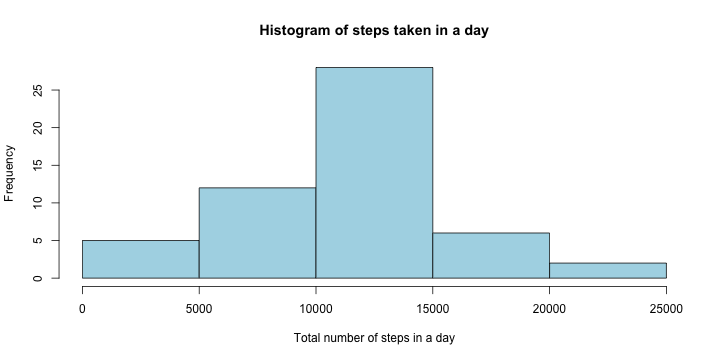
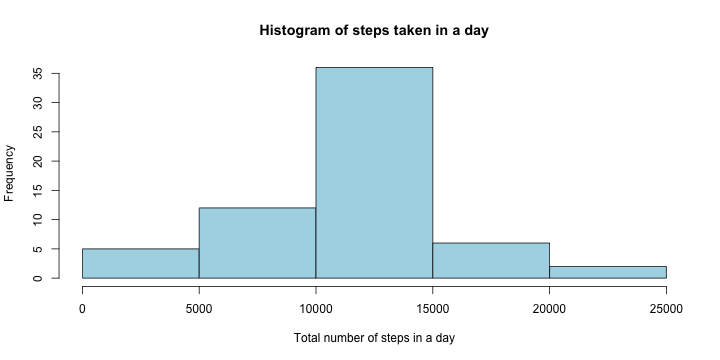
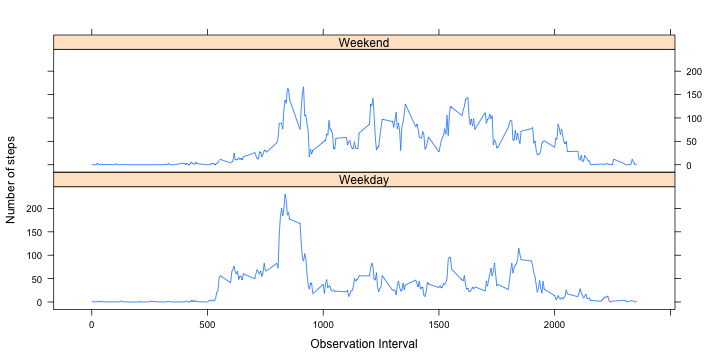

title: "Reproducible Research: Peer Assessment 1"
output: 
  html_document:
    keep_md: true
    self_contained: false


 Reproducible Research: Peer Assessment 1
-----------------------------------------

##1. Loading and preprocessing the data

Load the necessary libraries like *dplyr* for data wrangling.
Read the csv file and store as input with NA values, also create another data frame *omitting* NA values

"activity.csv" should be present in the current working directory


```r
library(dplyr)
input_with_na <- read.csv("activity.csv")	
input <- na.omit(input_with_na)
```

##2. What is mean total number of steps taken per day?

Aggregate/summarise the input without NAs by Date and compute the sum total of steps taken in a day
Plot the total steps taken per day in a histogram


```r
steps_summary <- input %>% group_by(date) %>% summarise(Total=sum(steps))
hist(steps_summary$Total,col="lightblue",xlab="Total number of steps in a day",main="Histogram of steps taken in a day")
```

 

The mean and median value for steps taken in the data set

```r
mean_1 <- mean(steps_summary$Total)

median_1 <- median(steps_summary$Total)
```
The mean value is **1.0766189 &times; 10<sup>4</sup>** an median value is **10765**

## 3. What is the average daily activity pattern?

a. Make a time series plot (i.e. type = ???l???) of the 5-minute interval (x-axis) and the average number of steps taken, averaged across all days (y-axis).
Get the input grouped by time interval ( 5 seconds range) and compute the average/mean.
Display it using a plot.

```r
timeinterval_steps <- input %>% group_by(interval) %>% summarise(Average=mean(steps))
plot(timeinterval_steps,type="l",col="blue")
```

 


b. Which 5-minute interval, on average across all the days in the dataset, contains the maximum number of steps?


```r
max_num_steps <- timeinterval_steps[which.max(timeinterval_steps$Average),]
```
The maximum steps across all days is **206.1698113** at the interval **835**

## 4. Imputing missing values
a. Note that there are a number of days/intervals where there are missing values (coded as NA). The presence of missing days may introduce bias into some calculations or summaries of the data.

Calculate and report the total number of missing values in the dataset (i.e. the total number of rows with NAs).


```r
missing_rows <- (nrow(input_with_na)- nrow(na.omit(input_with_na)))
```

No of row with missing value is  **2304**

b. Devise a strategy for filling in all of the missing values in the dataset. The strategy does not need to be sophisticated. For example, you could use the mean/median for that day, or the mean for that 5-minute interval, etc
We replace the NA by the mean for that 5 minute interval.
c. Create a new dataset that is equal to the original dataset but with the missing data filled in.


```r
for(row in 1:nrow(input_with_na)){
if(is.na(input_with_na$steps[row])){
interval_range <- input_with_na$interval[row]
temp<-filter(timeinterval_steps,interval==interval_range)
input_with_na$steps[row]<- temp$Average
}
}
```
d. Make a histogram of the total number of steps taken each day and Calculate and report the mean and median total number of steps taken per day. Do these values differ from the estimates from the first part of the assignment? What is the impact of imputing missing data on the estimates of the total daily number of steps?


```r
filled_input_summary <- input_with_na %>%  group_by(date) %>% summarise(Total=sum(steps))

hist(filled_input_summary$Total,col="lightblue",xlab="Total number of steps in a day",main="Histogram of steps taken in a day")
```

 

The average for newly filled data is computed below 


```r
mean_2 <- mean(filled_input_summary$Total)

median_2 <- median(filled_input_summary$Total)
```
The newly computed mean is **1.0766189 &times; 10<sup>4</sup>** and the median is **1.0766189 &times; 10<sup>4</sup>

## 5. Are there differences in activity patterns between weekdays and weekends?
a. Create a new factor variable in the dataset with two levels ??? ???weekday??? and ???weekend??? indicating whether a given date is a weekday or weekend day.


```r
day <- weekdays(as.Date(input_with_na$date))
dayfactor <- vector()
for (i in 1:nrow(input_with_na)) {
if (day[i] == "Saturday") {
dayfactor[i] <- "Weekend"
} else if (day[i] == "Sunday") {
dayfactor[i] <- "Weekend"
} else {
dayfactor[i] <- "Weekday"
}
}
input_with_na$dayfactor <- dayfactor
input_with_na$dayfactor <- factor(input_with_na$dayfactor)
```


b. Make a panel plot containing a time series plot (i.e. type = "l") of the 5-minute interval (x-axis) and the average number of steps taken, averaged across all weekday days or weekend days (y-axis). See the README file in the GitHub repository to see an example of what this plot should look like using simulated data.


```r
library(lattice)
stepsPerDay<- aggregate(steps~interval + dayfactor, data=input_with_na, mean)
xyplot(steps ~ interval | dayfactor, stepsPerDay, type = "l", 
layout = c(1, 2),xlab = "Observation Interval", ylab = "Number of steps")
```

 

